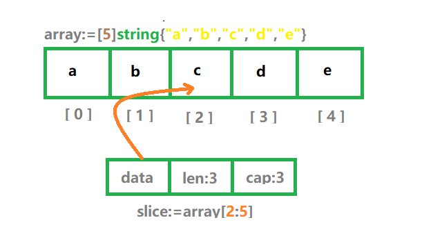

# 思考题

> 计算100以内的偶数之和

```go
package main

import (
	"fmt"
)

func main() {
	sum := 0
	for i := 0; i <= 100; i++ {
		if i%2 != 0 {
			continue
		}
		sum += i
	}
	fmt.Println("the sum is:", sum)
}
```

> 如果i不是偶数，就会用continue跳出本次循环，继续下一个循环；如果是偶数，则继续执行sum+=i，然后继续循环

# Array（数组）

> 数组存放的是<font color=red>固定长度、相同类型</font>的数据，而且这些存放的元素是连续的。所存放的<font color=red>数据类型没有限制</font>，可以是整型、字符串甚至自定义

### 数组声明

> 示例：一个字符串数组，长度是 5，所以其类型定义为 [5]string，其中大括号中的元素用于初始化数组。此外，在类型名前加 [] 中括号，并设置好长度，就可以通过它来推测数组的类型。

> 注意：[5]string 和 [4]string 不是同一种类型，也就是说长度也是数组类型的一部分

> ch04/main.go

```go
array:=[5]string{"a","b","c","d","e"}
```

> 数组在内存中都是连续存放的


> 可以看到，数组的每个元素都是连续存放的，每一个元素都有一个下标（Index）。下标从 0 开始，比如第一个元素 a 对应的下标是 0，第二个元素 b 对应的下标是 1。以此类推，通过 array+[下标] 的方式，我们可以快速地定位元素

> ch04/main.go

```go
package main

import (
	"fmt"
)

func main() {
	array := [5]string{"a", "b", "c", "d", "e"}
	fmt.Println(array[2])
}
```

> 结果输出

```shell
[root@localhost gotour]# go run ch04/main.go 
c
```
> 在定义数组的时候，数组的长度可以忽略，这时Go语言会自动根据大括号{}中元素的个数推导出长度，以上示例可以修改为

```go
array := [...]string{"a", "b", "c", "d", "e"}
```

> 以上省略数组长度的声明只适用于所有元素都被初始化的数组，如果是针对特定索引元素初始化的情况，就不适合了

```go
package main

import (
	"fmt"
)

func main() {
	array1 := [5]string{1:"a", 3:"d"}
	fmt.Println(array1[3])
}
```

> 示例中的「1:"b",3:"d"」的意思表示初始化索引 1 的值为 b，初始化索引 3 的值为 d，整个数组的长度为 5。如果我省略长度 5，那么整个数组的长度只有 4，显然不符合我们定义数组的初衷，此外，没有初始化的索引，其默认值都是数组类型的零值，也就是 string 类型的零值 "" 空字符串

> 除了使用[]操作符根据索引快速定位数组的元素外，还可以通过for循环打印所有的数组元素

> ch04/main.go

```go
package main

import (
	"fmt"
)

func main() {
	array := [5]string{"a", "b", "c", "d", "e"}
	for i := 0; i < 5; i++ {
		fmt.Printf("数组索引%d，对应值%s。\n", i, array[i])
	}
}
```

### 数组循环

> 使用传统的 for 循环遍历数组，输出对应的索引和对应的值，这种方式很烦琐，一般不使用，大部分情况下，使用的是 for range 这种 Go 语言的新型循环

> ch04/main.go

```go
package main

import (
	"fmt"
)

func main() {
	array := [5]string{"a", "b", "c", "d", "e"}
	for i,v:=range array {
		fmt.Printf("数组索引%d，对应值%s。\n", i, v)
	}
}
```

- 对于数组，range 表达式返回两个结果
    - 第一个是数组的索引
    - 第二个是数组的值
    
> 如果返回的值用不到，可以使用 _ 下划线丢弃

```go
package main

import (
	"fmt"
)

func main() {
	array := [5]string{"a", "b", "c", "d", "e"}
	for _,v:=range array {
		fmt.Printf("对应值%s。\n", v)
	}
}
```

# Slice（切片）

> 切片和数组类似，可以把它理解为动态数组。切片是基于数组实现的，它的底层就是一个数组，对数组任意分隔，就可以得到一个切片。

### 基于数组生成切片

> ch04/main.go

```go
package main

import (
	"fmt"
)

func main() {
	array := [5]string{"a", "b", "c", "d", "e"}
        slice := array[2:5]
        fmt.Println(slice)
}
```

> array[2:5] 就是获取一个切片的操作，它包含从数组 array 的索引 2 开始到索引 5 结束的元素

> 注意：这里是包含索引 2，但是不包含索引 5 的元素，即在 : 右边的数字不会被包含。

```go
//基于数组生成切片，包含索引start，但是不包含索引end
slice:=array[start:end]
```

>  array[2:5] 获取到的是 c、d、e 这三个元素，然后这三个元素作为一个切片赋值给变量 slice，切片和数组一样，也可以通过索引定位元素

> 虽然切片底层用的也是 array 数组，但是经过切片后，切片的索引范围改变了

> 通过下图可以看出，切片是一个具备三个字段的数据结构，分别是指向数组的指针 data，长度 len 和容量 cap



- 小技巧
    - array[:4] 等价于 array[0:4]
    - array[1:] 等价于 array[1:5]
    - array[:] 等价于 array[0:5]

### 切片修改

> 切片的值也可以被修改，这里也同时可以证明切片的底层是数组

> 对切片相应的索引元素赋值就是修改，在下面的代码中，把切片 slice 索引 1 的值修改为 f，然后打印输出数组 array

> ch04/main.go

```go
package main

import (
	"fmt"
)

func main() {
	array := [5]string{"a", "b", "c", "d", "e"}
        fmt.Println("修改切片前:",array)
        slice := array[2:5]
        slice[1] = "f"
        fmt.Println("修改切片后:",array)
}
```

> 运行结果

```shell
[root@localhost ch04]# go run main.go 
修改切片前: [a b c d e]
修改切片后: [a b c f e]
```

> 数组对应的值已经被修改为 f，所以这也证明了基于数组的切片，使用的底层数组还是原来的数组，一旦修改切片的元素值，那么底层数组对应的值也会被修改

### 切片声明

> 使用make函数声明切片

> 下面的代码是声明了一个元素类型为 string 的切片，长度是 4，make 函数还可以传入一个容量参数

> ch04/main.go

```go
slice1 := make([]string,4)
```
> 下面示例，指定了新创建的切片[]string容量为8

```go
slice1 := make([]string,4,8)
```

> 注意：<font color=red>切片的容量不能比切片的长度小</font>

> 上面的示例说明，Go 语言在内存上划分了一块容量为 8 的内容空间（容量为 8），但是只有 4 个内存空间才有元素（长度为 4），其他的内存空间处于空闲状态，当通过 append 函数往切片中追加元素的时候，会追加到空闲的内存上，<font color=red>当切片的长度要超过容量的时候，会进行扩容</font>

> 切片不仅可以通过 make 函数声明，也可以通过字面量的方式声明和初始化

```go
package main

import (
	"fmt"
)

func main() {
        slice1 := []string{"a","b","c","d","e"}
        fmt.Println(len(slice1), cap(slice1))
}
```

> 运行结果

```shell
[root@localhost ch04]# go run main.go 
5 5
```

> 可以注意到，<font color=red>切片和数组的字面量初始化方式，差别就是中括号 [] 里的长度。此外，通过字面量初始化的切片，长度和容量相同</font>

### Append

> 可以通过内置的append函数对一个切片追加元素，返回新切片

```go
//追加一个元素
slice2:=append(slice1,"f")
//多加多个元素
slice2:=append(slice1,"f","g")
//追加另一个切片
slice2:=append(slice1,slice...)
```
> append函数可以有以上三种操作

> 小技巧：<font color=red>在创建新切片的时候，最好要让新切片的长度和容量一样，这样在追加操作的时候就会生成新的底层数组，从而和原有数组分离，就不会因为共用底层数组导致修改内容的时候影响多个切片</font>

### 切片元素循环

> 切片的循环与数组一样，常用也是for range方式

> 在Go语言开发中，切片是使用最多的，尤其是作为函数的参数时，相比数组，通常会优先选择切片，因为它高效，内存占用小

> 示例ch04/main.go

```go
package main

import (
	"fmt"
)

func main() {
	slice1 := []string{"a", "b", "c", "d", "e"}
	slice2 := append(slice1, "f")
	for i, v := range slice2 {
		fmt.Printf("切片索引%d,对应值%s。\n", i, v)
	}
}
```

> 运行结果

```shell
[root@localhost ch04]# go run main.go 
切片索引0,对应值a。
切片索引1,对应值b。
切片索引2,对应值c。
切片索引3,对应值d。
切片索引4,对应值e。
切片索引5,对应值f。
```

# Map（映射）

> 在 Go 语言中，map 是一个<font color=red>无序的 K-V 键值对集合</font>，结构为 map[K]V。其中 K 对应 Key，V 对应 Value。map 中所有的 Key 必须具有相同的类型，Value 也同样，但 Key 和 Value 的类型可以不同。此外，<font color=red>Key 的类型必须支持 == 比较运算符</font>，这样才可以判断它是否存在，并保证 Key 的唯一。

### Map声明初始化

- 创建一个map可以通过内置的make函数

> ch04/main.go

```go
nameAgeMap := make(map[string]int)
```

> 它的key类型为string，value类型为int。创建好map变量后就可以对其进行操作

> 添加键值对，key为lsj，value为25，如果key已经存在，则更新key对应的value

```go
package main

import (
	"fmt"
)

func main() {
	nameAgeMap := make(map[string]int)
	nameAgeMap["lsj"] = 25
	fmt.Println(nameAgeMap)
}
```

> 除了可以通过make函数创建map外，还可以通过字面量的方式

```go
package main

import (
	"fmt"
)

func main() {
	nameAgeMap := map[string]int{"lsj": 25}
	fmt.Println(nameAgeMap)
}
```

> 在创建map的同时添加键值对，如果不想添加键值对，使用空大括号{}即可，需要注意的是，<font color=red>大括号不能省略</font>

### Map获取和删除

> map的操作、切片和数组差不多，都是通过[]操作符，只不过数组切片的[]中是索引，而map的[]是key

```go
package main

import (
	"fmt"
)

func main() {
	nameAgeMap := make(map[string]int)
	// 添加键值对或者更新 key 的value
	nameAgeMap["lsj"] = 25
    //  获取指定 Key 对应的value
	age := nameAgeMap["lsj"]
	fmt.Println("lsj的年龄是:", age)
}
```

> Go语言的map可以获取不存在的K-V键值对，如果Key不存在，返回的Value是该类型的零值，比如int的零值就是0。所以很多时候，我们需要先判断map中的key是否存在

> map的[]操作符可以返回两个值
- 第一个值对应的Value
- 第二个值标记该Key是否存在，如果存在，它的值为true

> ch04/main.go

```go
package main

import (
	"fmt"
)

func main() {
	nameAgeMap := make(map[string]int)
	// 添加键值对或者更新 key 的value
	nameAgeMap["lsj"] = 25
	age, ok := nameAgeMap["lsj"]
	if ok {
		fmt.Println("lsj的年龄是:", age)
	}
}
```

> 示例中，age是返回的 value， ok用来标记该key是否存在，如果存在则打印age

> 如果删除map中的键值对，使用内置的delete函数即可，比如要删除nameAgeMap中的Key为lsj的键值对，则

```go
package main

import (
	"fmt"
)

func main() {
	nameAgeMap := make(map[string]int)
	nameAgeMap["lsj"] = 25
	delete(nameAgeMap, "lsj")
	fmt.Println(nameAgeMap)
}
```
> <font color=red>delete有两个参数：第一个参数是map，第二个参数是要删除键值对的key</font>

### 遍历Map

> map是一个键值对集合，它同样可以被遍历，在Go语言中，map的遍历使用for range循环

- 对于map、for range返回两个值：
    - 第一个是 map 的 Key
    - 第二个是 map 的 Value

> ch04/main.go

```go
package main

import (
	"fmt"
)

func main() {
	nameAgeMap := make(map[string]int)
	nameAgeMap["lsj"] = 25
	nameAgeMap["lsj1"] = 26
	nameAgeMap["lsj2"] = 27
	for k, v := range nameAgeMap {
		fmt.Println("Key is:", k, ", Age is:", v)
	}
}
```

> 执行结果

```shell
[root@localhost gotour]# go run ch04/main.go 
Key is: lsj , Age is: 25
Key is: lsj1 , Age is: 26
Key is: lsj2 , Age is: 27
```

> 需要注意的是<font color=red>map的便利是无序的</font>，也就是说每次遍历，键值对的顺序可能会不一样。如果想按顺序遍历，可以先获取所有的key，并对key排序，然后根据排序好的key获取对应的value

```go
package main

import (
	"sort"
	"fmt"
)

func main() {
	nameAgeMap := make(map[string]int)
	nameAgeMap["张三"] = 25
	nameAgeMap["张三1"] = 26
	nameAgeMap["张三2"] = 27
	nameAgeMap["张三3"] = 28

	array := []string{}
	for k := range nameAgeMap {
		array = append(array, k)
	}
	fmt.Println(array)
	sort.Strings(array)
	fmt.Println(array)
	for _,v := range array{
		fmt.Printf("%s: %d\n", v, nameAgeMap[v])
	}
}
```

> 执行结果

```shell
[root@localhost gotour]# go run ch04/main.go 
[张三3 张三 张三1 张三2]
[张三 张三1 张三2 张三3]
张三: 25
张三1: 26
张三2: 27
张三3: 28
```

> 小技巧：for range map的时候，也可以使用一个值返回。使用一个返回值的时候，这个返回值默认是map的key

### Map的大小

> 和数组切片不一样，map是没有容量的，它只有长度，也就是map的大小（键值对的个数）。获取map的大小，使用内置的len函数即可

```go
package main

import (
	"fmt"
)

func main() {
	nameAgeMap := make(map[string]int)
	nameAgeMap["张三"] = 25
	nameAgeMap["张三1"] = 26
	nameAgeMap["张三2"] = 27
	nameAgeMap["张三3"] = 28
	fmt.Println("键值对长度:", len(nameAgeMap))
}
```

### String和[]byte

> 字符串string也是一个不可变的直接序列，所以可以直接转为字节切片[]byte

> ch04/main.go

```go
package main

import (
	"fmt"
)

func main() {
	s := "hello, 张三"
	bs := []byte(s)
	fmt.Println(bs)
}
```

> string不止可以直接转为[]byte，还可以使用[]操作获取指定索引的直接值

> ch04/main.go

```go
package main

import (
	"fmt"
)

func main() {
	s := "hello 飞雪无情"
	bs := []byte(s)
	fmt.Println(bs)
	fmt.Println(s[0], s[1], s[15])
	fmt.Println(len(s))
}
```

> 字符串s里的字母和中文加起来是9个字符，因为字符串是字节序列，每一个索引对应的是一个字节，而在UTF8编码下，一个汉字对应三个字节，所以字符串长度其实是17

> 如果先把一个汉字当成一个长度计算，可以使用utf8.RuneCountlnString函数，运行以下代码，可以看到打印结果是9，也就是9个unicode(utf8)字符

```go
package main

import (
	"unicode/utf8"
	"fmt"
)

func main() {
	s := "Hello 飞雪无情"
	bs := []byte(s)
	fmt.Println(bs)
	fmt.Println(utf8.RuneCountInString(s))
}
```

> 下面示例代码中，i是索引，r是unicode字符对应的unicode码点，这也说明了for range循环在处理字符串的时候，会自动地隐式解码unicode字符串

> ch04/main.go

```go
package main

import (
	"fmt"
)

func main() {
	s := "Hello 飞雪无情"
	for i, r := range s {
		fmt.Println(i, r)
	}
}
```


# 思考题

>数组、切片还可以分为二维和多维，比如二维字节切片就是[][]byte，三维就是[][][]byte，不常用

> 注意：如果map的key的类型式整型，并且集合中的元素比较少，应该尽量选择切片，因为效率更高。在实际的项目开发中，数组并不常用，尤其式在函数间作为参数传递的时候，用的最多的式切片，更灵活，且内存占用少

> 创建一个二维数组并使用它

```go
package main

import (
	"fmt"
)

func main() {
	array := [3][2]string{{"a", "b"}, {"c", "d"}, {"e", "f"}}
	for i := range array {
		index := len(array[i])
		for j := 0; j < index; j++ {
			fmt.Println(array[i][j])
		}
	}
}
```
