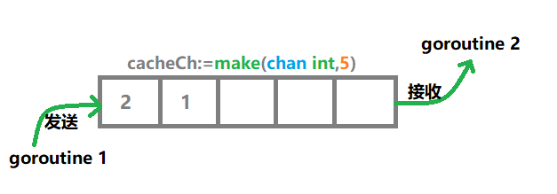

# 08 | 并发基础：Goroutines 和 Channels的声明与使用

## 问题

是否可以有多个defer，如果可以执行顺序是怎样的？

```go
package main

import "fmt"

func moreDefer() {
	defer fmt.Println("first defer")
	defer  fmt.Println("Second defer")
   	defer  fmt.Println("Three defer")
   	fmt.Println("函数自身代码")
}

func main()  {
	moreDefer()
}
```

> 输出结果：
>
> 函数自身代码
> Three defer 
> Second defer
> first defer

1. 在一个方法或函数中，可以有多个defer语句
2. 多个defer语句的执行顺序依照后进先出的原则

## 什么是并发

### 进程

在操作系统中，进程是一个非常重要的概念。当你启动一个软件（比如浏览器）的时候，操作系统会为这个软件创建一个进程，这个进程是该软件的工作空间，它包含了软件运行所需的所有资源，比如内存空间、文件句柄，还有下面要讲的线程等。

### 线程

线程是进程的执行空间，一个进程可以有多个线程，线程被操作系统调度执行，比如下载一个文件，发送一个消息等。这种多个线程被操作系统同时调度执行的情况，就是多线程的并发。

一个程序启动，就会有对应的进程被创建，同时进程也会启动一个线程，这个线程叫作主线程。如果主线程结束，那么整个程序就退出了。有了主线程，就可以从主线里启动很多其他线程，也就有了多线程的并发。

### 协程

<font color=red>Go 语言中没有线程的概念，只有协程，也称为 goroutine</font>。相比线程来说，协程更加轻量，一个程序可以随意启动成千上万个 goroutine

goroutine 被 Go runtime 所调度，这一点和线程不一样。也就是说，Go 语言的并发是由 Go 自己所调度的，自己决定同时执行多少个 goroutine，什么时候执行哪几个。这些对于我们开发者来说完全透明，只需要在编码的时候告诉 Go 语言要启动几个 goroutine，至于如何调度执行，我们不用关心。

```go
func main() {
   go fmt.Println("大锤")
   fmt.Println("我是 main goroutine")
   time.Sleep(time.Second)
}
```

这样就启动了一个 goroutine，用来调用 fmt.Println 函数，打印“大锤”。所以这段代码里有两个 goroutine，一个是 main 函数启动的 main goroutine，一个是我自己通过 go 关键字启动的 goroutine。

go 关键字后跟一个方法或者函数的调用，就可以启动一个 goroutine，让方法在这个新启动的 goroutine 中运行。

```go
go function()
```

> 输出结果
>
> 我是main goroutine
> 大锤

从输出结果也可以看出，程序是并发的，go 关键字启动的 goroutine 并不阻塞 main goroutine 的执行

## Channel

那么如果启动了多个 goroutine，它们之间该如何通信呢？这就是 Go 语言提供的 channel（通道）要解决的问题。

### 声明一个channel

```go
ch:=make(chan string)
```

其中 chan 是一个关键字，表示是 channel 类型。后面的 string 表示 channel 里的数据是 string 类型。通过 channel 的声明也可以看到，chan 是一个集合类型。

#### 一个channel只有两种操作

1. 接收：获取chan中的值的，操作符为<-chan
2. 发送：向chan发送值，把值放在chan中，操作符为chan<-

```go
package main

import (
	"fmt"
)

func main() {
	ch := make(chan string)
	go func() {
		fmt.Println("大锤")
		ch <- "goroutine 完成"
	}()
	fmt.Println("我是main goroutine")
	v := <-ch
	fmt.Println("接收到的chan中的值为: ", v)
}
```

> 输出结果
>
> 我是main goroutine
> 大锤
> 接收到的chan中的值为:  goroutine 完成

#### 理解：

在上面的示例中，我们在新启动的 goroutine 中向 chan 类型的变量 ch 发送值；在 main goroutine 中，从变量 ch 接收值；如果 ch 中没有值，则阻塞等待到 ch 中有值可以接收为止。

相信你应该明白为什么程序不会在新的 goroutine 完成之前退出了，因为通过 make 创建的 chan 中没有值，而 main goroutine 又想从 chan 中获取值，获取不到就一直等待，等到另一个 goroutine 向 chan 发送值为止。

channel 有点像在两个 goroutine 之间架设的管道，一个 goroutine 可以往这个管道里发送数据，另外一个可以从这个管道里取数据，有点类似于我们说的队列。

### 无缓冲channel

上面的示例中，使用 make 创建的 chan 就是一个无缓冲 channel，它的容量是 0，不能存储任何数据。所以<font color=red>无缓冲 channel 只起到传输数据的作用</font>，数据并不会在 channel 中做任何停留。这也意味着，<font color=red>无缓冲 channel 的发送和接收操作是同时进行的，它也可以称为同步 channel</font>。

### 有缓冲channel

有缓冲 channel 类似一个可阻塞的队列，内部的元素先进先出。通过 make 函数的第二个参数可以指定 channel 容量的大小，进而创建一个有缓冲 channel

```go
cacheCh:=make(chan int,5)
```

创建了一个容量为 5 的 channel，内部的元素类型是 int，也就是说这个 channel 内部最多可以存放 5 个类型为 int 的元素



#### 一个有缓冲channel具备以下特点：

1. 有缓冲channel的内部又一个缓冲队列
2. 发送操作是向队列的尾部插入元素，如果队列已满，这阻塞等待，知道另一个goroutine执行，接收操作释放空间
3. 接收操作是从队列的头部获取元素并把它从队列中删除，如果队列为空，则阻塞等待，直到另一个 goroutine 执行，发送操作插入新的元素。

```go
cacheCh:=make(chan int,5)
cacheCh <- 2
cacheCh <- 3
fmt.Println("cacheCh容量为:",cap(cacheCh),",元素个数为：",len(cacheCh))
```


通过内置函数 cap 可以获取 channel 的容量，也就是最大能存放多少个元素，通过内置函数 len 可以获取 channel 中元素的个数。

> 无缓冲 channel 其实就是一个容量大小为 0 的 channel。比如 make(chan int,0)。

## 关闭channel

channel 还可以使用内置函数 close 关闭

```go
close(cacheCh)
```

如果一个 channel 被关闭了，就不能向里面发送数据了，如果发送的话，会引起 painc 异常。但是还可以接收 channel 里的数据，如果 channel 里没有数据的话，接收的数据是元素类型的零值。

## 单向channel

限制一个 channel 只可以接收但是不能发送，或者限制一个 channel 只能发送但不能接收，这种 channel 称为单向 channel。

```go
onlySend := make(chan<- int)
onlyReceive := make(<-chan int)
```

在函数或者方法的参数中，使用单向 channel 的较多，这样可以防止一些操作影响了 channel。

下面示例中的 counter 函数，它的参数 out 是一个只能发送的 channel，所以在 counter 函数体内使用参数 out 时，只能对其进行发送操作，如果执行接收操作，则程序不能编译通过。

```go
func counter(out chan<- int){
    //函数内容使用变量out，只能进行发送操作
}
```

## select + channel示例

假设要从网上下载一个文件，我启动了 3 个 goroutine 进行下载，并把结果发送到 3 个 channel 中。其中，哪个先下载好，就会使用哪个 channel 的结果。

在这种情况下，如果我们尝试获取第一个 channel 的结果，程序就会被阻塞，无法获取剩下两个 channel 的结果，也无法判断哪个先下载好。这个时候就需要用到多路复用操作了，在 Go 语言中，通过 select 语句可以实现多路复用，其语句格式如下：

```go
select {
case i1 = <-c1:
     //todo
case c2 <- i2:
	//todo
default:
	// default todo
}
```

整体结构和 switch 非常像，都有 case 和 default，只不过 select 的 case 是一个个可以操作的 channel。

> 多路复用可以简单地理解为，N 个 channel 中，任意一个 channel 有数据产生，select 都可以监听到，然后执行相应的分支，接收数据并处理。

#### 实现下载例子

```go
package main

import (
	"fmt"
	"time"
)

func main() {
	// 声明三个存放结果的channel
	firstCh := make(chan string)
	secondCh := make(chan string)
	threeCh := make(chan string)
	// 同时开启3个goroutine下载
	go func() {
		firstCh <- downloadFile("firstCh")
	}()
	go func() {
		secondCh <- downloadFile("secondCh")
	}()
	go func() {
		threeCh <- downloadFile("threeCh")
	}()
	// 开始select多路复用，哪个channel能获取到值
	// 就说明哪个先下载好，就用哪个
	select {
	case filePath := <-firstCh:
		fmt.Println(filePath)
	case filepath := <-secondCh:
		fmt.Println(filepath)
	case filePath := <-threeCh:
		fmt.Println(filePath)
	}
}

func downloadFile(chanName string) string {
	// 模拟下文件，可以自己随机time.Sleep时间点
	time.Sleep(time.Second)
	return chanName + " : filePath"
}
```

如果这些 case 中有一个可以执行，select 语句会选择该 case 执行，如果同时有多个 case 可以被执行，则随机选择一个，这样每个 case 都有平等的被执行的机会。如果一个 select 没有任何 case，那么它会一直等待下去。

