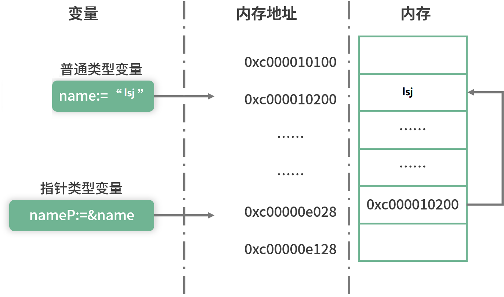

# 12 | 指针详解：在声明情况下应该使用指针？

## 什么是指针

我们都知道程序运行时的数据是存放在内存中的，而内存会被抽象为一系列具有连续编号的存储空间，那么每一个存储在内存中的数据都会有一个编号，这个编号就是内存地址。有了这个内存地址就可以找到这个内存中存储的数据，而内存地址可以被赋值给一个指针。

> 在编程语言中，<font color=red>指针是一种数据类型，用来存储一个内存地址，该地址指向存储在该内存中的对象</font>。这个对象可以是字符串、整数、函数或者你自定义的结构体。

举个通俗的例子，每本书中都有目录，目录上会有相应章节的页码，你可以把页码理解为一系列的内存地址，通过页码你可以快速地定位到具体的章节（也就是说，通过内存地址可以快速地找到存储的数据）。

## 指针的声明和定义

在 Go 语言中，获取一个变量的指针非常容易，使用取地址符 & 就可以

```go
func main(){
    name:="lsj"
    nameP:=&name
    fmt.Println("name变量的值为:",name)
    fmt.Println("name变量的内存地址为:",nameP)
}
```

> 示例中定义了一个string类型的变量name，值为"lsj"，然后通过取地址符&取出name的内存地址，并赋值给指针变量nameP，该指针变量的类型为*string

指针类型非常廉价，只占用4个或者8个直接的内存大小

以上示例中 nameP 指针的类型是 *string，用于指向 string 类型的数据。在 Go 语言中使用类型名称前加 * 的方式，即可表示一个对应的指针类型。比如 int 类型的指针类型是 *int，float64 类型的指针类型是 *float64，自定义结构体 A 的指针类型是 *A。总之，指针类型就是在对应的类型前加 * 号。



上图的例子所对应的示意图，从图中可以看到普通变量 name 的值“lsj”被放到内存地址为 0xc000010200 的内存块中。指针类型变量也是变量，它也需要一块内存用来存储值，这块内存对应的地址就是 0xc00000e028，存储的值是 0xc000010200。相信你已经看到关键点了，指针变量 nameP 的值正好是普通变量 name 的内存地址，所以就建立指向关系。

> 指针变量的值就是它所指向数据的内存地址，普通变量的值就是我们具体存放的数据。

不同的指针类型是无法相互赋值的，比如你不能对一个 string 类型的变量取地址然后赋值给 *int指针类型，编译器会提示你 Cannot use '&name' (type *string) as type *int in assignment。

此外，除了可以通过简短声明的方式声明一个指针类型的变量外，也可以使用 var 关键字声明，如下面示例中的 var intP *int 就声明了一个 *int 类型的变量 intP

```go
var intP *int
//指针类型不同，无法赋值
intP = &name
```

可以看到指针变量也和普通的变量一样，既可以通过 var 关键字定义，也可以通过简短声明定义。

> 通过 var 声明的指针变量是不能直接赋值和取值的，因为这时候它仅仅是个变量，还没有对应的内存地址，它的值是 nil。

和普通类型不一样的是，指针类型还可以通过内置的 new 函数来声明

```go
intP1:=new(int)
```

内置的 new 函数有一个参数，可以传递类型给它。它会返回对应的指针类型，比如上述示例中会返回一个 *int 类型的 intP1

## 指针的操作

在 Go 语言中指针的操作无非是两种：一种是获取指针指向的值，一种是修改指针指向的值。

获取指针的值

```go
nameV:=*nameP
fmt.Println("nameP指针指向的值:",nameV)
```

要获取指针指向的值，只需要在指针变量前加 * 号即可，获得的变量 nameV 的值就是“lsj”，方法比较简单

修改指针指向的值

```go
*nameP="Hanson"
fmt.Println("nameP指针指向的值为:",*nameP)
fmt.Println("name变量的值为:",name)
```

对 *nameP 赋值等于修改了指针 nameP 指向的值

结果：

>nameP指针指向的值为: Hanson
>name变量的值为: Hanson

通过打印结果可以看到，不光 nameP 指针指向的值被改变了，变量 name 的值也被改变了，这就是指针的作用。因为变量 name 存储数据的内存就是指针 nameP 指向的内存，这块内存被 nameP 修改后，变量 name 的值也被修改了。

我们已经知道，通过 var 关键字直接定义的指针变量是不能进行赋值操作的，因为它的值为 nil，也就是还没有指向的内存地址。

```go
var intP *int
*intP=10
```

运行的时候会提示 invalid memory address or nil pointer dereference。这时候该怎么办呢？其实只需要通过 new 函数给它分配一块内存就可以了

```go
var intP *int = new(int)
//更推荐简短声明法，这里是为了演示
//intP:=new(int)
```

## 指针参数

假如有一个函数 modifyAge，想要用来修改年龄，如下面的代码所示。但运行它，你会看到 age 的值并没有被修改，还是 18，并没有变成 20。

```go
age:=18
modifyAge(age)
fmt.Println("age的值为:",age)

func modifyAge(age int)  {
   age = 20
}
```

导致这种结果的原因是 modifyAge 中的 age 只是实参 age 的一份拷贝，所以修改它不会改变实参 age 的值。

```go
age := 10
modifyAge(&age)
fmt.Println("age的值为:",age)

func modifyAge(age *int)  {
   *age = 20
}
```

也就是说，当你需要在函数中通过形参改变实参的值时，需要使用指针类型的参数。

## 指针接收者

1. 如果接收者类型是 map、slice、channel 这类引用类型，不使用指针；
2. 如果需要修改接收者，那么需要使用指针；
3. 如果接收者是比较大的类型，可以考虑使用指针，因为内存拷贝廉价，所以效率高。

## 什么情况下使用指针

从以上指针的详细分析中，我们可以总结出指针的两大好处：

1. 可以修改指向数据的值；
2. 在变量赋值，参数传值的时候可以节省内存。

## 总结了以下几点使用指针的建议：

1. 不要对 map、slice、channel 这类引用类型使用指针；

2. 如果需要修改方法接收者内部的数据或者状态时，需要使用指针；

3. 如果需要修改参数的值或者内部数据时，也需要使用指针类型的参数；

4. 如果是比较大的结构体，每次参数传递或者调用方法都要内存拷贝，内存占用多，这时候可以考虑使用指针；

5. 像 int、bool 这样的小数据类型没必要使用指针；

6. 如果需要并发安全，则尽可能地不要使用指针，使用指针一定要保证并发安全；

7. 指针最好不要嵌套，也就是不要使用一个指向指针的指针，虽然 Go 语言允许这么做，但是这会使你的代码变得异常复杂。

