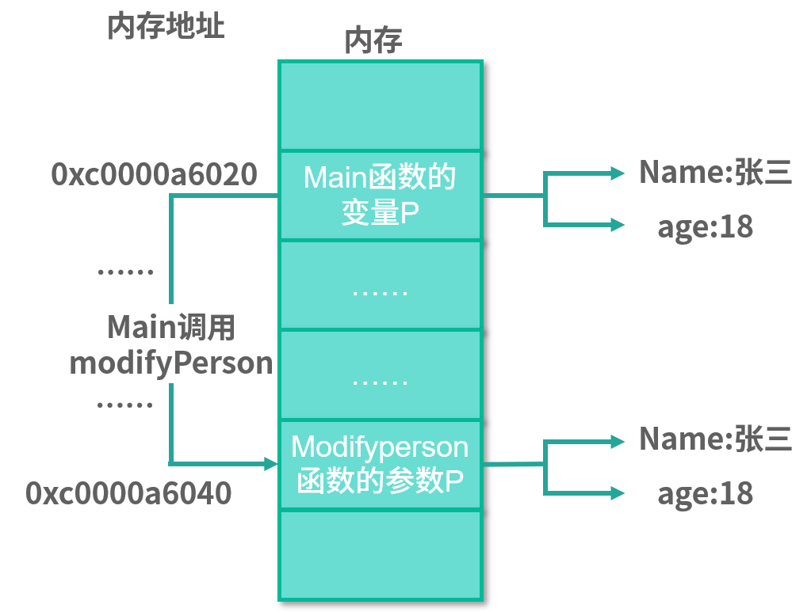

# 13 | 参数传递：值、引用及指针之间的区别

值类型 address 作为接收者实现了接口 fmt.Stringer，那么它的指针类型 *address 也就实现了接口 fmt.Stringer

```go
type address struct {
    province string
    city string
}
func (addr address) String() string{
    return fmt.Sprintf("the addr is %s%s",addr.province,addr.city)
}
```

在下面的代码示例中，定义了值类型的变量 add，然后把它和它的指针 &add 都作为参数传给函数 printString，发现都是可以的，并且代码可以成功运行。这也证明了当值类型作为接收者实现了某接口时，它的指针类型也同样实现了该接口。

```go
func main() {
   add := address{province: "北京", city: "北京"}
   printString(add)
   printString(&add)
}
func printString(s fmt.Stringer) {
   fmt.Println(s.String())
}
```

```go
var si fmt.Stringer =address{province: "上海",city: "上海"}
printString(si)
sip:=&si
printString(sip)
```

在这个示例中，因为类型 address 已经实现了接口 fmt.Stringer，所以它的值可以被赋予变量 si，而且 si 也可以作为参数传递给函数 printString。

接着你可以使用 sip:=&si 这样的操作获得一个指向接口的指针，这是没有问题的。不过最终你无法把指向接口的指针 sip 作为参数传递给函数 printString，Go 语言的编译器会提示你如下错误信息：

> ./main.go:42:13: cannot use sip (type *fmt.Stringer) as type fmt.Stringer in argument to printString:
> 	*fmt.Stringer is pointer to interface, not interface

总结：虽然指向具体类型的指针可以实现一个接口，但是指向接口的指针永远不可能实现该接口。

所以你几乎从不需要一个指向接口的指针，把它忘掉吧，不要让它在你的代码中出现。

## 修改参数

假设你定义了一个函数，并在函数里对参数进行修改，想让调用者可以通过参数获取你最新修改的值。

```go
package main

import "fmt"

func main() {
	p := person{name: "张三", age: 30}
	modifyPerson(p)
	fmt.Println("person name:", p.name, ",age:", p.age)
}

func modifyPerson(p person) {
	p.name = "李四"
	p.age = 20
}

type person struct {
	name string
	age  uint
}
```

在这个示例中，我期望通过 modifyPerson 函数把参数 p 中的 name 修改为李四，把 age 修改为 20 。代码没有错误，但是运行一下，你会看到如下打印输出

```go
person name: 张三 ,age: 30
```

怎么还是张三与 18 呢？我换成指针参数试试，因为在上节课中我们已经知道可以通过指针修改指向的对象数据

```go
package main

import "fmt"

func main() {
	p := person{name: "张三", age: 30}
	modifyPerson(&p)
	fmt.Println("person name:", p.name, ",age:", p.age)
}

func modifyPerson(p *person) {
	p.name = "李四"
	p.age = 20
}

type person struct {
	name string
	age  uint
}
```

这些代码用于满足指针参数的修改，把接收的参数改为指针参数，以及在调用 modifyPerson 函数时，通过&取地址符传递一个指针。现在再运行程序，就可以看到期望的输出了

```go
person name: 李四 ,age: 20
```

## 值类型

在上面的小节中，我定义的普通变量 p 是 person 类型的。在 Go 语言中，person 是一个值类型，而 &p 获取的指针是 *person 类型的，即指针类型。那么为什么值类型在参数传递中无法修改呢？这也要从内存讲起。

对比值类型变量在函数内外的内存地址

```go
package main

import "fmt"

func main() {
	p:=person{name: "张三",age: 30}
	fmt.Printf("main函数：p的内存地址为%p\n",&p)
	modifyPerson(p)
	fmt.Println("person name:",p.name,",age:",p.age)
}

func modifyPerson(p person) {
	fmt.Printf("modifyPerson函数：p的内存地址为%p\n",&p)
	p.name = "李四"
	p.age = 20
}

type person struct {
	name string
	age  uint
}
```

> 结果：
>
> main函数：p的内存地址为0xc000004078
> modifyPerson函数：p的内存地址为0xc000004090
> person name: 张三 ,age: 30

你会发现它们的内存地址都不一样，这就意味着，在 modifyPerson 函数中修改的参数 p 和 main 函数中的变量 p 不是同一个，这也是我们在 modifyPerson 函数中修改参数 p，但是在 main 函数中打印后发现并没有修改的原因。

导致这种结果的原因是 **Go 语言中的函数传参都是值传递**。 值传递指的是传递原来数据的一份拷贝，而不是原来的数据本身。



以 modifyPerson 函数来说，在调用 modifyPerson 函数传递变量 p 的时候，Go 语言会拷贝一个 p 放在一个新的内存中，这样新的 p 的内存地址就和原来不一样了，但是里面的 name 和 age 是一样的，还是张三和 18。这就是副本的意思，变量里的数据一样，但是存放的内存地址不一样。

除了 struct 外，还有浮点型、整型、字符串、布尔、数组，这些都是值类型。

## 指针类型

指针类型的变量保存的值就是数据对应的内存地址，所以在函数参数传递是传值的原则下，拷贝的值也是内存地址。

```go
package main

import "fmt"

func main() {
	p:=person{name: "张三",age: 30}
	fmt.Printf("main函数：p的内存地址为%p\n",&p)
	modifyPerson(&p)
	fmt.Println("person name:",p.name,",age:",p.age)
}

func modifyPerson(p *person) {
	fmt.Printf("modifyPerson函数：p的内存地址为%p\n",p)
	p.name = "李四"
	p.age = 20
}

type person struct {
	name string
	age  uint
}
```

> 结果
>
> main函数：p的内存地址为0xc000004078
> modifyPerson函数：p的内存地址为0xc000004078
> person name: 李四 ,age: 20

所以指针类型的参数是永远可以修改原数据的，因为在参数传递时，传递的是内存地址

> 值传递的是指针，也是内存地址。通过内存地址可以找到原数据的那块内存，所以修改它也就等于修改了原数据。

## 引用类型

### map

对于上面的例子，假如我不使用自定义的 person 结构体和指针，能不能用 map 达到修改的目的呢？

```go
package main

import "fmt"

func main() {
	m := make(map[string]int)
	m["寒梅清风"] = 20
	fmt.Println("寒梅清风的年龄为",m["寒梅清风"])
	modifyMap(m)
	fmt.Println("寒梅清风的年龄为",m["寒梅清风"])
	
}


func modifyMap(p map[string]int)  {
	p["寒梅清风"]=22
}
```

我定义了一个 map[string]int 类型的变量 m，存储一个 Key 为寒梅清风、Value 为 20 的键值对，然后把这个变量 m 传递给函数 modifyMap。modifyMap 函数所做的事情就是把对应的值修改为 22。现在运行这段代码，通过打印输出来看是否修改成功

```go
寒梅清风的年龄为 20
寒梅清风的年龄为 22
```

确实修改成功了。你是不是有不少疑惑？没有使用指针，只是用了 map 类型的参数，按照 Go 语言值传递的原则，modifyMap 函数中的 map 是一个副本，怎么会修改成功呢？

要想解答这个问题，就要从 make 这个 Go 语言内建的函数说起。在 Go 语言中，任何创建 map 的代码（不管是字面量还是 make 函数）最终调用的都是 runtime.makemap 函数。

> 用字面量或者 make 函数的方式创建 map，并转换成 makemap 函数的调用，这个转换是 Go 语言编译器自动帮我们做的。

从下面的代码可以看到，makemap 函数返回的是一个 *hmap 类型，也就是说返回的是一个指针，所以我们创建的 map 其实就是一个 *hmap。

```go
// makemap implements Go map creation for make(map[k]v, hint).
func makemap(t *maptype, hint int, h *hmap) *hmap{
  //省略无关代码
}
```

因为 Go 语言的 map 类型本质上就是 *hmap，所以根据替换的原则，我刚刚定义的 modifyMap(p map) 函数其实就是 modifyMap(p *hmap)。这是不是和上一小节讲的指针类型的参数调用一样了？这也是通过 map 类型的参数可以修改原始数据的原因，因为它本质上就是个指针。

为了进一步验证创建的 map 就是一个指针，我修改上述示例，打印 map 类型的变量和参数对应的内存地址

```go
package main

import "fmt"

func main() {
	m := make(map[string]int)
	m["寒梅清风"] = 20
	fmt.Printf("main函数：m的内存地址为%p\n",m)
	fmt.Println("寒梅清风的年龄为",m["寒梅清风"])
	modifyMap(m)
	fmt.Println("寒梅清风的年龄为",m["寒梅清风"])
	
}


func modifyMap(p map[string]int)  {
	p["寒梅清风"]=22
	fmt.Printf("modifyMap函数：p的内存地址为%p\n",p)
}
```

运行后结果

```go
main函数：m的内存地址为0xc0000d2390
寒梅清风的年龄为 20
modifyMap函数：p的内存地址为0xc0000d2390
寒梅清风的年龄为 22
```

从输出结果可以看到，它们的内存地址一模一样，所以才可以修改原始数据，得到年龄是 20 的结果。而且我在打印指针的时候，直接使用的是变量 m 和 p，并没有用到取地址符 &，这是因为它们本来就是指针，所以就没有必要再使用 & 取地址了。

所以在这里，Go 语言通过 make 函数或字面量的包装为我们省去了指针的操作，让我们可以更容易地使用 map。其实就是语法糖，这是编程界的老传统了。

> 这里的 map 可以理解为引用类型，但是它本质上是个指针，只是可以叫作引用类型而已。在参数传递时，它还是值传递，并不是其他编程语言中所谓的引用传递。

### chan

channel ，它也可以理解为引用类型，而它本质上也是个指针。

通过下面的源代码可以看到，所创建的 chan 其实是个 *hchan，所以它在参数传递中也和 map 一样。

```go
func makechan(t *chantype, size int64) *hchan {
    //省略无关代码
}
```

严格来说，Go 语言没有引用类型，但是我们可以把 map、chan 称为引用类型，这样便于理解。除了 map、chan 之外，Go 语言中的函数、接口、slice 切片都可以称为引用类型。

> 指针类型也可以理解为是一种引用类型。

## 类型的零值

在 Go 语言中，定义变量要么通过声明、要么通过 make 和 new 函数，不一样的是 make 和 new 函数属于显式声明并初始化。如果我们声明的变量没有显式声明初始化，那么该变量的默认值就是对应类型的零值。

|          类型          |      零值      |
| :--------------------: | :------------: |
| 数值类型(int、float等) |       0        |
|          bool          |     false      |
|         string         |  ""(空字符串)  |
|         struct         | 内部字段的零值 |
|         slice          |      nil       |
|          map           |      nil       |
|          指针          |      nil       |
|          函数          |      nil       |
|          chan          |      nil       |
|       interface        |      nil       |

## 总结：

在 Go 语言中，函数的参数传递只有值传递，而且传递的实参都是原始数据的一份拷贝。如果拷贝的内容是值类型的，那么在函数中就无法修改原始数据；如果拷贝的内容是指针（或者可以理解为引用类型 map、chan 等），那么就可以在函数中修改原始数据。

